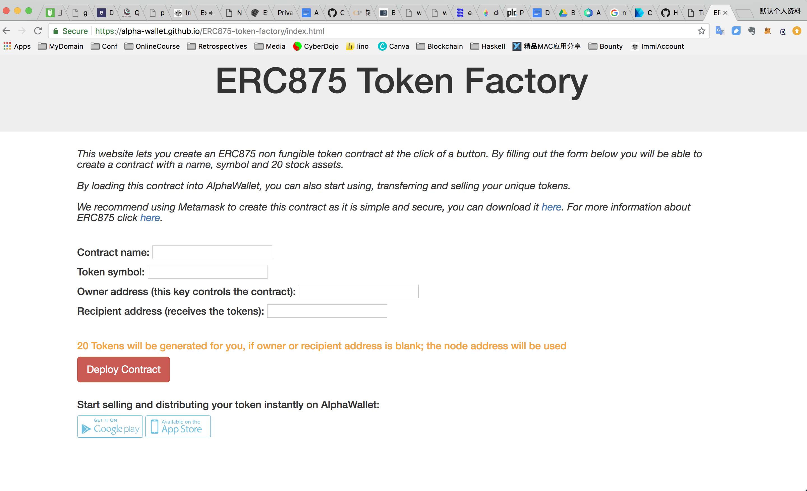
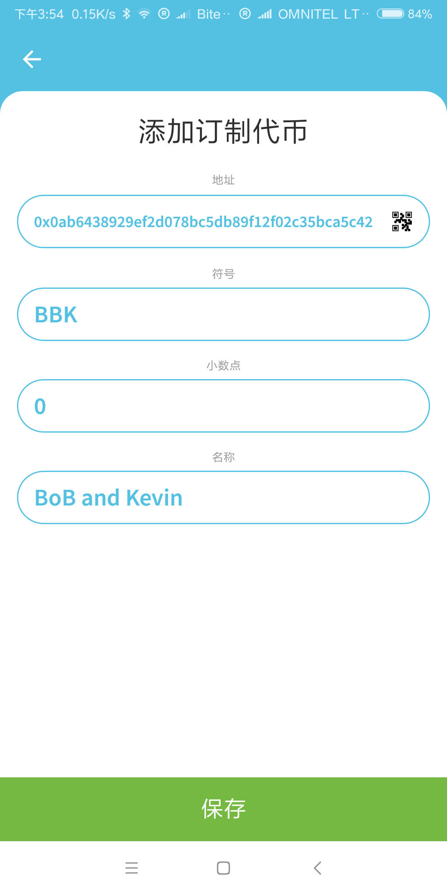

# 如何优雅的发布并使用 ERC875 非同质代币（non-fungible token - NFTs）

## 什么是非同质代币（NFTs）
非同质代币，顾名思义，指的是代币之间是不一样的。举个简单的例子，电影票是很常见的非同质代币，每一张电影票代表不同时间段与不同的座位，提供了观赏电影的服务。

与之对应的是同质代币，常见的例子是钞票，比如2张100元面钞是可以互换的（或者说一样的）。

因此非同质代币和同质代币之间的区别，显而易见，代币之间是否可以互换。

## 什么是 ERC875 非同质代币
ERC 是 Ethereum Request Comments，是以太坊上的建议。ERC875 和 ERC721 一样，是非同质代币，但具有不同的接口。ERC875 与 ERC721 有两个最大的不同之处：

- 一次买卖中，ERC875 只需要一次交易，因此只需要支付一次 gas。（通过magiclink的方式，实现了原子交易）
- 多个代币可以在一次交易中进行买卖。（比如卖家需要10张票打包销售）

[ERC875更多说明](https://github.com/ethereum/EIPs/issues/875)

## 准备事项

为了发布非同质代币，你需要准备一系列事项：

- MetaMask，一款以太坊轻钱包。
- 以太币，或测试网络的以太币（假设我们使用Ropsten测试网络）。
- AlphaWallet，管理 ERC875 代币的钱包。

### 安装 MetaMask 轻钱包
访问 [MetaMask官方网站](https://metamask.io/)，点击获取 MetaMask Chrome插件。

安装好Metamask后，你需要有一个以太坊钱包地址。两种方式可以获得以太坊钱包地址：

1. 在MetaMask中创建
2. 在AlphaWallet中创建

或者其他以太坊钱包中创建钱包地址，都是可以的。但我们可以在不同钱包之间互相导入导出以太坊钱包。（用助记词或私钥 -- 强烈不建议私钥方式导入导出）

这里我们需要MetaMask，AlphaWallet中用的是同一个钱包地址。因此我们需要用助记词或者私钥来导出导入以太坊钱包。

#### MetaMask中创建以太坊钱包
MetaMask是用来支付发布代币时gas的。MetaMask安装完成后，点击Chrome浏览器的插件启动如下图：

1. 设置登录密码
2. 选择以太坊网络（如Ropsten测试网络）
3. 创建新的钱包地址
4. 导出私钥
5. AlphaWallet中导入私钥(参见AlphaWallet部分)

**选择以太坊网络**， 如下图

**创建或导入钱包**

**导出私钥**

  

[如何创建MetaMask账号，英文](https://support.ddex.io/hc/en-us/articles/115004413273-Create-a-new-MetaMask-account)

#### AlphaWallet中创建以太坊钱包
AlphaWallet是用来管理 ERC875 代币的

在AlphaWallet中可以导入创建的 ERC875 代币。导入后的结果如下图：

### 安装AlphaWallet钱包
访问 [AlphaWallet网站](https://www.awallet.io/)，可以从网站下载apk安装包，或google play, apple store下载。安装后的界面如下：

### 获取以太坊 Ropten 测试网络代币
访问 [MetaMask Faucet](http://faucet.metamask.io/) 输入以太坊钱包地址，获取Ropsten测试网络的代币。

## 发布 ERC875 非同质代币

访问 [ERC875 token factory](http://x.awallet.io/)，如下图：

输入相对应的参数：

- Contract name, 合约名字。AlphaWallet主界面会显示该合约名字
- Token symbol, 代币符号。如ETH代表以太币
- Owner address, 合约owner地址。
- Recipient address, 接收ERC875代币的地址。

点击Deploy Contract按钮  
弹出的MetaMask界面中，点击Submit按钮  

合约执行会提示如下对话框：  

合约执行的情况，可以通过etherscan跟踪。  

查看结果可能如下：  

Contract Overview右边点击生成合约的二维码  

## AlphaWallet中导入生成的代币
打开AlphaWallet钱包，如下图：  

点击右上角+  

点击地址右边的二维码（打开相机）  

点击保存  

## 如何使用 ERC875 代币

在AlphaWallet中，可以有如下方法使用 ERC875 代币：

1. 兑换，即使用代币。对应场景是我们持票消费，换取对应的服务。
2. 转让，免费转让给其他人。
3. 售出，即可以指定价格销售代币。

### 兑换
兑换（使用）代币需要4步  

- 打开ERC875代币
- 点击兑换按钮
- 选择其中的一个代币，点击下一步
- 点击兑换，会出现使用代币的二维码。（等待服务提供商扫描二维码，提供服务）

### 转让

- 打开ERC875代币
- 点击转让按钮
- 选择其中的一个代币，点击下一步
- 确认代币数量，点击下一步
- 可以选择通过MagicLink导出，或直接转让（建议使用MagicLink）点击下一步
- 设置MagicLink有效期，点击下一步
- 点击创建连接
- 选择一个接收连接的方式
- 你可以把MagicLink通过任何方式，发送给你想赠与的朋友

- 接受者复制连接
- 接受者打开AlphaWallet，自动导入复制的转让代币（注意，接受者钱包需要有足够的以太币作为gas）

### 售出

- 打开ERC875代币
- 点击出售按钮
- 选择其中的一个代币，点击下一步
- 确认出售价格，点击下一步
- 设置MagicLink有效期，点击下一步
- 点击创建连接
- 选择一个接收连接的方式
- 你可以把MagicLink通过任何方式（社交媒体、邮件等）进行推广

- 购买者者复制连接
- 购买者打开AlphaWallet，自动导入复制的代币，进入交易界面（需要支付卖家指定的价格和gas）

